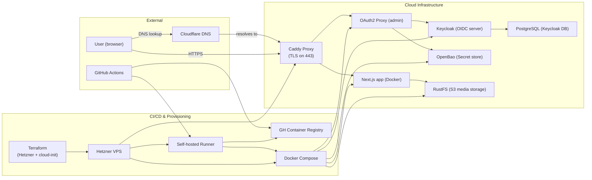

# CAId

Central Authorization and Identity bootstrap scripts.

This repo is intentionally small. A blank web-connected VPS should be able to clone it and run one script to provision the central CAId stack. In this project, CAId is the separate central auth and policy layer. It owns the identity system, secret store, and the admin-facing security boundary that the website stack consumes later.

It deploys:

- OpenBao
- Keycloak
- PostgreSQL for Keycloak
- Caddy reverse proxy

The script does not assume Docker is already installed. It installs missing host dependencies, writes the required stack files, pulls public container images, starts the stack, initializes and unseals OpenBao, bootstraps OpenBao policies and AppRole credentials, bootstraps Keycloak clients and roles, and prints the AppRole credentials needed by a downstream app VPS.

## Security boundary

This repo owns the separate corporate auth/policy VPS. It does not deploy the public-facing application stack.

The intended boundary is:

- OpenBao is the source of truth for runtime secrets
- Keycloak is the source of truth for user identity and role assignments
- app VPSes authenticate to OpenBao with AppRole
- admin-facing services are meant to be private or overlay-restricted even when the public site is internet-facing

## Platform layout



This diagram describes the wider platform relationship. In repo terms, CAId is responsible for the Keycloak and OpenBao side of that picture, and the website repo is responsible for the application and media side.

## Clone and bootstrap

Minimal curl-based install:

```bash
sudo apt-get update
sudo apt-get install -y curl
curl -fsSL https://raw.githubusercontent.com/tabeeb09/caid/main/scripts/setup-caid-vps.sh -o setup-caid-vps.sh
sudo bash setup-caid-vps.sh
```

Git-based install:

```bash
sudo apt-get update
sudo apt-get install -y git
git clone https://github.com/tabeeb09/caid.git
cd caid
sudo bash scripts/setup-caid-vps.sh
```

If you already have the repo checked out and want to rerun convergence/bootstrap logic:

```bash
cd /srv/caid
sudo bash scripts/setup-caid-vps.sh
sudo bash scripts/caid-converge.sh --mode noninteractive
```

`setup-caid-vps.sh` is the main one-shot bootstrap entrypoint. It installs dependencies, writes the CAId runtime files, starts the containers, and performs the first-time bootstrap steps.

## What the bootstrap prompts for

The script prompts for:

```text
AUTH_HOST
BAO_HOST
ZTNA_PROVIDER
VPN_CIDR
KEYCLOAK_BOOTSTRAP_ADMIN_USERNAME
APP_PUBLIC_URL
MEDIA_PUBLIC_URL
OAUTH2_PROXY_PUBLIC_URL
RUSTFS_BUCKET
GOOGLE_CLIENT_ID, optional
GOOGLE_CLIENT_SECRET, optional
ALLOWED_EMAILS, optional
DNS_PROVIDER, optional
CLOUDFLARE_ZONE_NAME, if DNS_PROVIDER=cloudflare
CLOUDFLARE_ZONE_ID, optional if DNS_PROVIDER=cloudflare
CLOUDFLARE_API_TOKEN, if DNS_PROVIDER=cloudflare
```

`AUTH_HOST` and `BAO_HOST` must be plain hostnames, not URLs and not `host:port` values.

Good:

```text
auth.example.internal
bao.example.internal
auth.localhost
bao.localhost
```

Bad:

```text
localhost:8080
https://auth.example.internal
```

`ZTNA_PROVIDER` can be:

```text
none
tailscale
netbird
```

If `tailscale` is selected, the script installs Tailscale if missing and prompts for an optional auth key. If the key is blank, Tailscale falls back to its interactive login flow.

If `netbird` is selected, the script installs NetBird if missing and prompts for an optional setup key and management URL.

## Generated state and recovery material

The overlay choice and setup values are saved in:

```text
/etc/caid/caid.env
```

That file is root-only and reused on later runs.

The bootstrap generates:

```text
KEYCLOAK_BOOTSTRAP_ADMIN_PASSWORD
KEYCLOAK_DB_PASSWORD
OpenBao root token
OpenBao unseal key
Keycloak client secrets
OpenBao AppRole credentials
```

On first OpenBao initialization, the script writes:

```text
/etc/caid/openbao-init.json
/etc/caid/OPENBAO-RECOVERY-README.txt
```

Back up `openbao-init.json` offline. It contains the OpenBao root token and unseal key.

## OpenBao and Keycloak output

The script writes the generated and prompted values into OpenBao paths:

```text
kv/data/website/prod
kv/data/rustfs/prod
kv/data/oauth2-proxy/prod
kv/data/keycloak/prod
kv/data/cloudflare/prod, only when DNS_PROVIDER=cloudflare
```

At the end, it prints:

```text
BAO_ADDR=https://<BAO_HOST>
OPENBAO_ROLE_ID=...
OPENBAO_SECRET_ID=...
```

Those AppRole credentials are what the app VPS bootstrap uses later.

## Install paths and startup

Default paths:

```text
/srv/caid       generated compose/config files
/etc/caid       env and OpenBao recovery material
/var/lib/caid   persistent container data
```

The setup script installs and enables:

```text
caid.service
```

Useful commands:

```bash
sudo systemctl status caid
sudo systemctl restart caid
sudo systemctl stop caid
sudo journalctl -u caid -f
```

The service runs `docker compose up -d` from `/srv/caid`, so OpenBao, Keycloak, Caddy, and Postgres come back after VPS reboot.

OpenBao itself intentionally comes back sealed after an OpenBao process restart unless you add a separate auto-unseal mechanism. The saved recovery file is what lets you unseal it again.

## Admin access

OpenBao is available at:

```text
https://<BAO_HOST>
```

Use the root token from:

```text
/etc/caid/openbao-init.json
```

for first setup or emergency recovery.

Keycloak is available at:

```text
https://<AUTH_HOST>
```

Log in with the bootstrap admin username you provided to the setup script and the generated password saved in `/etc/caid/caid.env`.

If you need to add a new app manually after bootstrap:

```text
1. Open https://<BAO_HOST>
2. Log in
3. Go to Secrets -> kv
4. Create a new path, for example my-new-app/prod
5. Add the app's key/value secrets
6. Create a policy allowing read access to that path
7. Create an AppRole using that policy
8. Copy the AppRole role_id and secret_id to that app VPS bootstrap
```

## Non-interactive use

You can pass values through environment variables:

```bash
sudo AUTH_HOST=auth.internal.example.com \
  BAO_HOST=bao.internal.example.com \
  ZTNA_PROVIDER=tailscale \
  TAILSCALE_AUTH_KEY=tskey-auth-... \
  VPN_CIDR=10.8.0.0/24 \
  KEYCLOAK_BOOTSTRAP_ADMIN_USERNAME=admin \
  bash scripts/setup-caid-vps.sh
```
